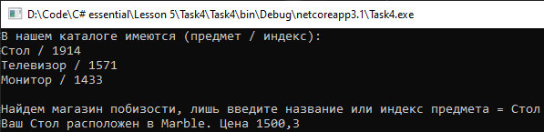

# Lesson5_task4
Условия задачки:
>Используя Visual Studio, создайте проект по шаблону Console Application.  
>Требуется:  
>Создать класс Article, содержащий следующие закрытые поля: 
>1. название товара; 
>2. название магазина, в котором продается товар; 
>3. стоимость товара в гривнах.

>Создать класс Store, содержащий закрытый массив элементов типа Article.  
>Обеспечить следующие возможности: 
>1. вывод информации о товаре по номеру с помощью индекса; 
>2. вывод на экран информации о товаре, название которого введено с клавиатуры, если таких товаров нет, выдать соответствующее сообщение; 

>Написать программу, вывода на экран информацию о товаре. 

Подытог: вот такенный майндфак на выходе
>
